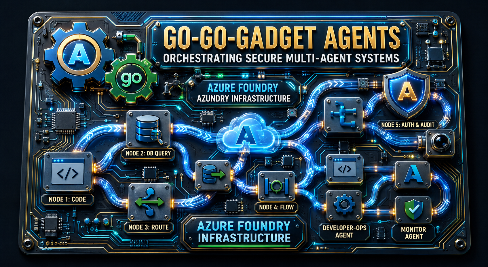
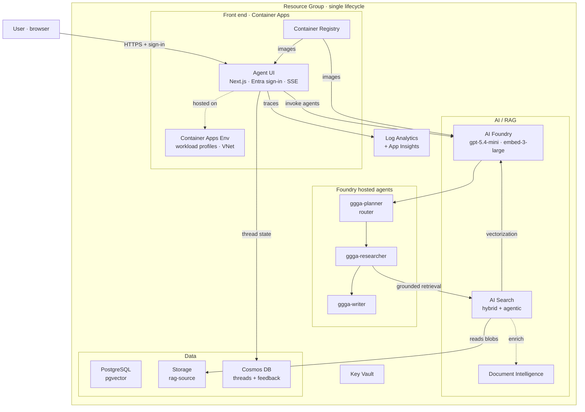

<p align="center">
  
</p>

# Go-Go-Gadget-Agents — End-to-End Agent Demo Infrastructure


Terraform (Azure Verified Modules + AzAPI) that stands up a complete, passwordless environment
for a **multi-agent** workflow on Azure AI Foundry — and the application that runs on it.

A Next.js **Agent UI** on Azure Container Apps signs users in with Entra ID and orchestrates three
**Foundry hosted agents** — `ggga-planner` → `ggga-researcher` → `ggga-writer` — over the Responses
protocol, grounded by a Foundry IQ RAG stack (AI Search + integrated vectorization + a knowledge agent).

- **One command to the platform** — `terraform apply` provisions ~58 resources in a single resource group.
- **Passwordless everywhere** — Entra ID + a shared managed identity; the only generated secret (Postgres password) lives in Key Vault.
- **Hosted agents, not glue code** — agents are immutable Foundry data-plane versions deployed with `azd`; the UI orchestrates the hand-offs.
- **Grounded answers** — hybrid (keyword + vector + semantic) search with agentic retrieval over your own documents.



> New here? Read [docs/architecture.md](docs/architecture.md) for the full system, or jump
> straight to the [Quickstart](#quickstart) below.

## Repository layout

| Path | What it is |
|------|------------|
| [`infra/terraform/`](infra/terraform/) | The platform — AVM + AzAPI Terraform for all Azure resources |
| [`agent-ui/`](agent-ui/) | Next.js chat UI (Entra sign-in, SSE, agent orchestration) — see [agent-ui/README.md](agent-ui/README.md) |
| [`hosted-agents/`](hosted-agents/) | Planner / Researcher / Writer Foundry agents — see [hosted-agents/README.md](hosted-agents/README.md) |
| [`scripts/`](scripts/) | Post-provision: Postgres seed + Foundry IQ (RAG) configuration |
| [`docs/`](docs/) | Architecture, design decisions, data flow, RBAC, best practices, deployment |

## Quickstart

### Prerequisites

- **Terraform >= 1.10** — `winget install Hashicorp.Terraform`
- **Azure CLI**, logged in (`az login`); the deployer is granted data-plane admin roles
- **uv** for the post-provision Python scripts — https://docs.astral.sh/uv/
- **azd** (`azd auth login`) to deploy the hosted agents
- A subscription with quota for the Foundry models in `foundry_location`

### 1. Provision the platform

```powershell
cd infra/terraform
Copy-Item terraform.tfvars.example terraform.tfvars   # edit as needed
terraform init
terraform apply
```

Post-provision steps run automatically via `local-exec`: the **Postgres seed**
(`scripts/seed_postgres`) and **Foundry IQ** RAG configuration (`scripts/foundry_iq`). If running
from CI / a service principal, set `entra_admin_principal_type = "ServicePrincipal"`.

### 2. Deploy the app

```powershell
# Build & push the UI image, set agent_ui_image in tfvars, then re-apply
az acr build --registry <acr-name> --image agent-ui:<tag> ./agent-ui

# Deploy each hosted agent (the agent version is a Foundry data-plane object)
cd hosted-agents/planner ; azd deploy
cd ../researcher         ; azd deploy
cd ../writer             ; azd deploy
```

### 3. Configure sign-in

Register an Entra app with a **web** redirect URI matching the `agent_ui_redirect_uri` Terraform
output, then set `azure_ad_client_id` / `azure_ad_client_secret` in `terraform.tfvars` and re-apply.
The secret is stored as a **native Container App secret** (encrypted, surfaced via `secretRef`).

Open the `agent_ui_fqdn` output, sign in, and chat — the planner → researcher → writer pipeline
runs live. For full deploy details, prerequisites, and the validated-deployment report, see
[docs/deployment.md](docs/deployment.md).

### Teardown

```powershell
cd infra/terraform ; terraform destroy
```

## Documentation

Start at the **[documentation hub](docs/README.md)**, or jump directly:

| Doc | Contents |
|-----|----------|
| [Architecture](docs/architecture.md) | System diagram, components, module strategy |
| [Design decisions](docs/design.md) | The *why* — hosted agents, Responses protocol, networking, secrets |
| [Data flow](docs/data-flow.md) | RAG ingestion + agentic retrieval (sequence diagrams) |
| [Orchestration](docs/orchestration.md) | Planner → Researcher → Writer pipeline |
| [Identity & RBAC](docs/rbac.md) | Passwordless model + role matrix |
| [Best practices](docs/best-practices.md) | Security, networking, and operations guidance |
| [Deployment](docs/deployment.md) | Deploy + post-provision workflow, validation report |

## License

Released under the [MIT License](LICENSE).
