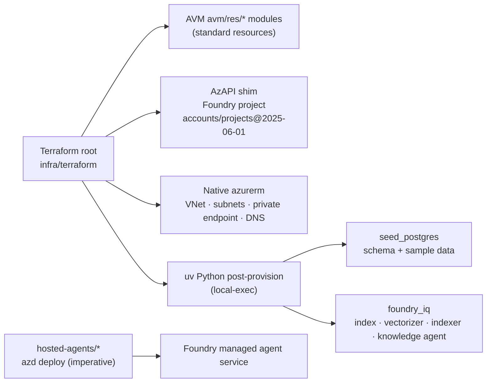

# Architecture

## System overview

```mermaid
flowchart TB
  User["User (browser)"]

  subgraph RG["Resource Group (single lifecycle)"]
    direction TB

    subgraph OBS["Observability"]
      LA["Log Analytics"]
      AI["Application Insights"]
    end

    UAMI["User-Assigned<br/>Managed Identity<br/>(shared, passwordless)"]
    KV["Key Vault<br/>(Postgres password)"]

    subgraph NET["Networking (VNet)"]
      CAESN["snet-cae-infra<br/>(CAE delegated)"]
      PESN["snet-pe + private DNS<br/>(Cosmos private endpoint)"]
    end

    subgraph FRONT["Front end (Container Apps)"]
      CAE["Container Apps Env<br/>(workload profiles, VNet)"]
      UI["Agent UI<br/>Next.js · Entra sign-in · SSE"]
      ACR["Container Registry"]
    end

    subgraph AGENTS["Foundry hosted agents"]
      PLAN["ggga-planner (router)"]
      RES["ggga-researcher"]
      WRIT["ggga-writer"]
    end

    subgraph AICORE["AI / RAG"]
      FOUNDRY["Azure AI Foundry (AIServices)<br/>• gpt-5.4-mini (LLM)<br/>• text-embedding-3-large<br/>• Foundry project"]
      SEARCH["Azure AI Search<br/>hybrid + agentic retrieval"]
      DI["Document Intelligence"]
    end

    subgraph DATA["Data"]
      PG["PostgreSQL Flexible<br/>Entra + password · pgvector"]
      ST["Storage Account<br/>container: rag-source"]
      COSMOS["Cosmos DB<br/>threads · feedback"]
    end
  end

  User -->|HTTPS + Entra sign-in| UI
  UI -->|pull image| ACR
  UI -->|invoke agents (Responses)| FOUNDRY
  UI -->|thread state / feedback| COSMOS
  UI -->|traces / OTel| AI
  UI -->|hosted on| CAE
  CAE -->|VNet egress| CAESN
  COSMOS -. private endpoint .- PESN

  FOUNDRY --> PLAN
  PLAN --> RES --> WRIT
  ACR -->|image pull (project MI)| FOUNDRY
  RES -->|grounded retrieval| SEARCH

  SEARCH -->|integrated vectorization| FOUNDRY
  SEARCH -->|indexer reads blobs| ST
  SEARCH -.->|parse complex docs| DI
  FOUNDRY -->|agentic queries| SEARCH

  AI --> LA
  UAMI -.->|identity| UI
```

## Component responsibilities

| Component | Role |
|-----------|------|
| **User-Assigned Managed Identity** | Single shared identity for the UI; service-to-service auth is passwordless (Entra ID). |
| **Log Analytics + Application Insights** | Central logs + distributed tracing/OpenTelemetry for the UI and agents. |
| **Key Vault** | Stores the only generated secret (Postgres admin password). *The Entra client secret is a native Container App secret — see [deployment.md](deployment.md).* |
| **Container Apps Environment + Agent UI** | Workload-profiles, VNet-integrated environment hosting the Next.js UI (Entra sign-in + SSE chat proxy). |
| **Container Registry** | Hosts the UI image (and the hosted-agent images the Foundry project pulls). |
| **Foundry hosted agents** | `ggga-planner` (router), `ggga-researcher`, `ggga-writer` — run on the Foundry managed agent service over the Responses protocol. |
| **Azure AI Foundry** | LLM (`gpt-5.4-mini`) and embeddings (`text-embedding-3-large`) + the agent project. |
| **Azure AI Search** | Hybrid index (keyword + vector + semantic) and Foundry IQ agentic retrieval. |
| **Document Intelligence** | Parses complex documents prior to Search ingestion. |
| **Storage (rag-source)** | Source documents for RAG enrichment; read by the Search indexer. |
| **PostgreSQL Flexible** | Relational sample dataset; `pgvector` for in-DB vector demos. |
| **Cosmos DB** | Durable agent thread/state (`threads`) and UI feedback (`feedback`); reached via a private endpoint. |
| **VNet + private endpoint** | Custom VNet for the CAE plus a Cosmos private endpoint (Cosmos public access is policy-disabled). |

## Module strategy



- **AVM `avm/res/*`** for: resource group, managed identity, Log Analytics, App Insights, Key
  Vault, Storage, Cosmos, PostgreSQL, AI Search, Cognitive Services (Foundry + Document
  Intelligence), Container Registry, Container Apps Environment, and the Agent UI Container App.
- **AzAPI** for the newer **Foundry project** (`Microsoft.CognitiveServices/accounts/projects@2025-06-01`).
- **Native `azurerm`** for the VNet, subnets, Cosmos private endpoint, and private DNS (`network.tf`).
- **Post-deploy `uv` scripts** for data-plane surfaces (Postgres seed, Foundry IQ).
- **Hosted agents** are deployed imperatively with `azd` (the agent *version* is a Foundry
  data-plane object, not a Terraform resource).

See [data-flow.md](data-flow.md), [orchestration.md](orchestration.md), [rbac.md](rbac.md),
and [deployment.md](deployment.md) for the detailed flows.

---

↩ Back to the [documentation hub](README.md) · Next: [design.md](design.md) — why it's built this way.
