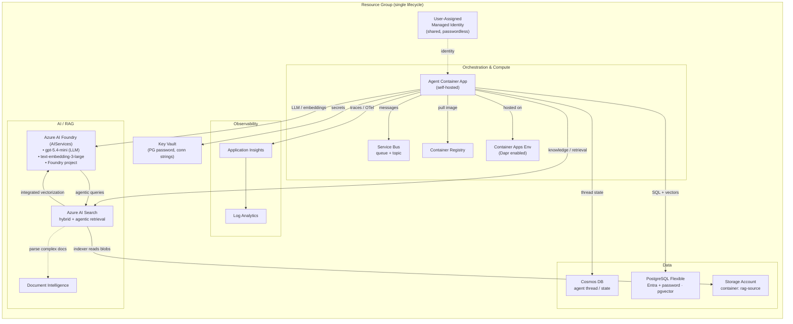
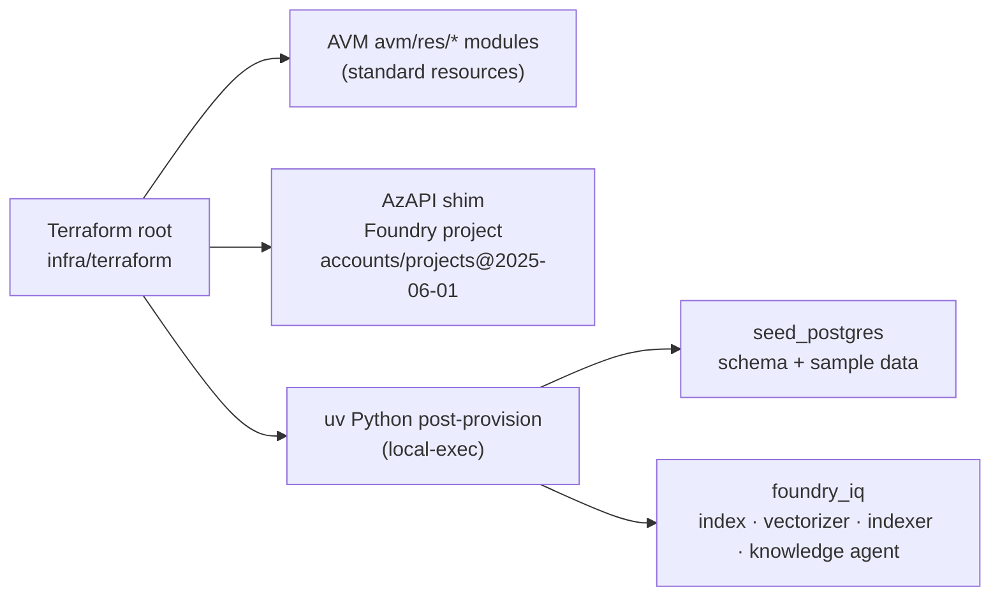

# Architecture

## System overview

## Component responsibilities

| Component | Role |
|-----------|------|
| **User-Assigned Managed Identity** | Single shared identity; all service-to-service auth is passwordless (Entra ID). |
| **Log Analytics + Application Insights** | Central logs + distributed tracing/OpenTelemetry for agents. |
| **Key Vault** | Stores the only generated secret (Postgres admin password) + connection strings. |
| **Azure AI Foundry** | LLM (`gpt-5.4-mini`) and embeddings (`text-embedding-3-large`) endpoints + agent project. |
| **Azure AI Search** | Hybrid index (keyword + vector + semantic) and Foundry IQ agentic retrieval. |
| **Document Intelligence** | Parses complex documents prior to Search ingestion. |
| **Storage (rag-source)** | Source documents for RAG enrichment; read by the Search indexer. |
| **PostgreSQL Flexible** | Relational sample dataset; `pgvector` for in-DB vector demos. |
| **Cosmos DB** | Durable agent thread/state/memory store. |
| **Service Bus** | Async messaging backbone for multi-step / multi-agent orchestration. |
| **Container Apps Env + App** | Self-hosted agent runtime, Dapr-enabled. |
| **Container Registry** | Hosts agent container images. |

## Module strategy

- **AVM `avm/res/*`** for: resource group, managed identity, Log Analytics, App Insights, Key
  Vault, Storage, Cosmos, PostgreSQL, Service Bus, AI Search, Cognitive Services (Foundry +
  Document Intelligence), Container Registry, Container Apps Environment + App.
- **AzAPI** for the newer **Foundry project** (`Microsoft.CognitiveServices/accounts/projects@2025-06-01`).
- **Post-deploy `uv` scripts** for data-plane surfaces that aren't control-plane resources.

See [data-flow.md](data-flow.md), [orchestration.md](orchestration.md), [rbac.md](rbac.md),
and [deployment.md](deployment.md) for the detailed flows.
