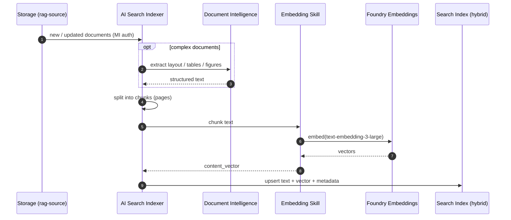
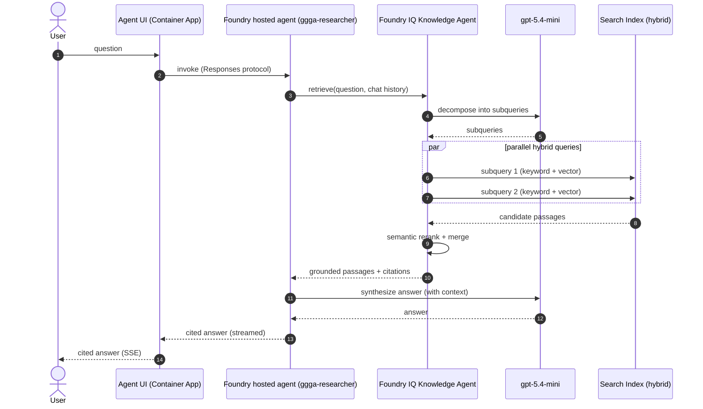

# Data Flow — RAG ingestion & agentic retrieval

## 1. Ingestion + integrated vectorization

How documents in the `rag-source` container become a hybrid-searchable index.

## 2. Agentic retrieval (Foundry IQ)

How an agent answers a complex question with grounded, cited results.

## Why hybrid + agentic

- **Hybrid** = keyword (BM25) + **vector** similarity + **semantic** reranker, so both exact
  terms and meaning are matched.
- **Agentic retrieval** decomposes complex/multi-part questions, runs subqueries in parallel,
  reranks, and returns traceable, cited evidence — improving relevance over single-shot RAG.

Configured by `scripts/foundry_iq/configure_foundry_iq.py` (index, vectorizer, skillset,
indexer, and knowledge agent). The embedding deployment and dimensions are parameterized.
