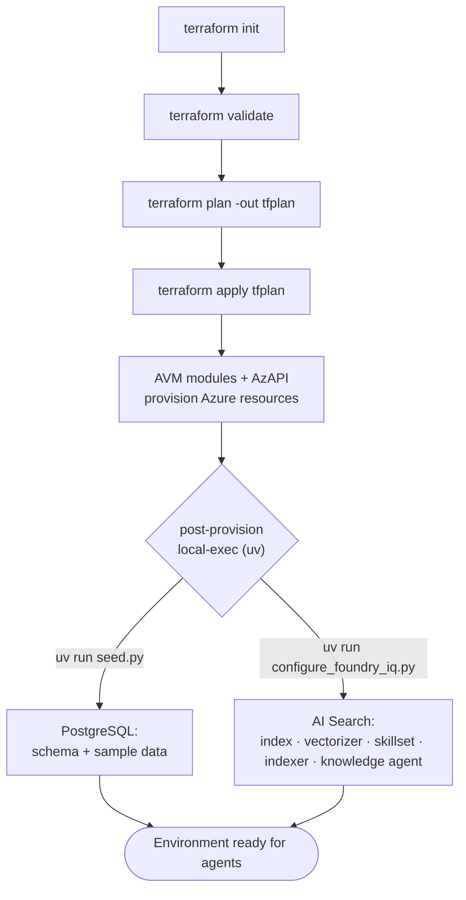

# Deployment & post-provision workflow



## Prerequisites

| Tool | Requirement |
|------|-------------|
| Terraform | **>= 1.10** (AVM storage submodules). Install via `winget install Hashicorp.Terraform`. |
| Azure CLI | Logged in (`az login`); the deployer is granted data-plane admin roles. |
| uv | For the post-provision Python scripts — https://docs.astral.sh/uv/ |
| Subscription | Quota for the Foundry models in `foundry_location`. |

## Commands

```powershell
cd infra/terraform
Copy-Item terraform.tfvars.example terraform.tfvars   # edit as needed

terraform init
terraform validate
terraform plan -out tfplan
terraform apply tfplan
```

## Post-provision steps (automatic)

Triggered by Terraform `null_resource` + `local-exec`:

1. **Postgres seed** — `scripts/seed_postgres` (`uv run seed.py`): applies `schema.sql` and
   seeds sample data (idempotent; only seeds when tables are empty).
2. **Foundry IQ config** — `scripts/foundry_iq` (`uv run configure_foundry_iq.py`): creates the
   Search index (integrated vectorization), skillset, indexer, and the knowledge agent.

Both re-run only when their script/schema hashes change (see `triggers` in the `.tf` files).

## Application deploy (UI + hosted agents)

Terraform provisions the platform; the application code is deployed imperatively afterwards.

### 1. Entra app for UI sign-in

The UI authenticates users with Entra ID (identity-only). Register an Entra application, add a
**web** redirect URI matching the UI's HTTPS FQDN (Terraform output `agent_ui_redirect_uri`),
and supply its client ID / secret to Terraform:

```hcl
# terraform.tfvars (gitignored)
azure_ad_client_id     = "<entra-app-client-id>"
azure_ad_client_secret = "<entra-app-client-secret>"
```

The client secret is stored as a **native Container App secret** (encrypted by the platform,
surfaced to the container via `secretRef` — never a plaintext env value). It is **not** stored
in Key Vault: the project Key Vault has public network access disabled by policy with no private
endpoint, so neither Terraform nor the app could reach a KV-backed secret. (Future hardening:
add a Key Vault private endpoint to the CAE VNet, then move the secret to KV.)

### 2. Build & push the UI image

```powershell
# from agent-ui/
az acr build --registry <acr-name> --image agent-ui:<tag> .
```

Set `agent_ui_image = "<acr>.azurecr.io/agent-ui:<tag>"` in `terraform.tfvars` and re-apply so
the Container App picks up the new revision.

### 3. Deploy the hosted agents

The three agents (`ggga-planner` → `ggga-researcher` → `ggga-writer`) run on the Foundry
managed agent service and are deployed imperatively with `azd` (each agent *version* is a
Foundry data-plane object, not a Terraform resource):

```powershell
# from each hosted-agents/<agent>/
azd deploy
```

`azd` builds/pushes the agent image, creates the immutable agent version, and assigns the
per-agent runtime identity the **Azure AI User** role at the Foundry account scope. See
[orchestration.md](orchestration.md) for the pipeline and [rbac.md](rbac.md) for identities.

## Teardown

```powershell
terraform destroy
```

Single resource group → one-command teardown.

## Notes & caveats

- **Model availability** in `westus3` is the main risk — hence a separate `foundry_location`
  (default `eastus2`) for the Foundry account + models.
- **Knowledge agent** is created with the typed `azure-search-documents` SDK
  (`SearchIndexClient.create_or_update_agent`), which pins a compatible preview API version.
  Earlier raw-REST payloads were rejected (`targetIndexes` not recognized), so the SDK path is
  authoritative — keep the SDK pinned in `scripts/foundry_iq/pyproject.toml`.
- Networking is **VNet-integrated**: a custom VNet (`network.tf`) hosts the workload-profiles
  Container Apps Environment (delegated infrastructure subnet) and a **Cosmos DB private
  endpoint** + private DNS zone, since Cosmos public access is force-disabled by policy. The UI
  still reaches public endpoints (Foundry, ACR) over the internet. State is **local** —
  parameterized for later hardening (remote `azurerm` backend).

## Validated deployment (2026-06) — real-world findings

A full `terraform apply` was run against an MCAPS subscription. All ~58 control-plane resources
deployed; both model deployments (`gpt-5.4-mini`, `text-embedding-3-large`) and the Foundry
project reached `Succeeded`; and the Foundry IQ pipeline (`rag-index` + `agents-knowledge`
agent) was created end-to-end via the `local-exec` step. Bugs found and fixed during validation:

| Fix | Detail |
|-----|--------|
| **Model version** | `gpt-5.4-mini` default version corrected to `2026-03-17` (verify per-region with `az cognitiveservices model list`). |
| **Foundry project** | Requires `allow_project_management = true` on the AIServices account. |
| **Cognitive local auth** | Set `local_auth_enabled = false` (Foundry + Document Intelligence) to align with policy and skip the AVM `listKeys` data source. |
| **Cosmos zones** | Override `geo_locations` with `zone_redundant = false` where the region lacks zonal Cosmos capacity. |
| **Key Vault RBAC race** | Added a `time_sleep` so data-plane RBAC propagates before secret writes. |
| **Knowledge agent** | Use the typed SDK (`create_or_update_agent`) instead of raw REST. |

### ⚠️ Environment constraints (governed subscriptions — *not* IaC defects)

Some subscriptions enforce Azure Policy / deny assignments that affect **local** post-provision
and `terraform plan` refresh. Observed on the validation MCAPS sub:

- **Key Vault & Postgres** `publicNetworkAccess` is force-**Disabled** by policy → the Postgres
  seed and KV secret reads cannot run from a public network. Use the `run_postgres_seed = false`
  toggle and run seeding from **inside** the network (see recommendation below).
- **Cognitive Services** `disableLocalAuth` is forced **true** → use RBAC/Entra only.
- **Cosmos DB** has a **deny assignment** blocking `listKeys`/`readonlykeys` even for Owner →
  use passwordless (AAD) Cosmos access; expect the key-based output to error on plan refresh.
- **Corpnet egress IP varies by destination**, so single-IP Search firewall rules are
  unreliable. Set `restrict_public_ip = false` to use **RBAC-only** Search.
- **PIM**: Owner is time-boxed and expires mid-session — re-elevate before long applies.

### Recommendation for customer / production environments

Enable **private networking** (VNet + private endpoints, parameterized off by default) and run
the post-provision scripts (`seed.py`, `configure_foundry_iq.py`) from **within the network** —
e.g., an Azure Container Instance or Container App job using the shared managed identity —
rather than from a developer workstation. This satisfies the public-access-disabled policies and
removes the corpnet-egress firewall fragility.
