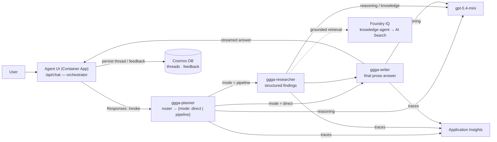

# Orchestration — multi-agent / multi-step workflows

Three **hosted Microsoft Agent Framework agents** run on the **Microsoft Foundry** managed agent
service and coordinate over the **Responses protocol**. The Next.js UI (`/api/chat`) is the
orchestrator: it calls the Planner, then conditionally fans through Researcher → Writer, and
streams attributed output to the browser over SSE. **Cosmos DB** stores thread state and
feedback; **Application Insights** captures distributed traces across the flow.

## Flow

1. **Planner** (`ggga-planner`) is a router. It returns JSON `{ mode: "direct" | "pipeline", ... }`.
   - `direct` — simple questions skip straight to the Writer.
   - `pipeline` — complex questions go through Researcher → Writer.
2. **Researcher** (`ggga-researcher`) turns the Planner's brief into structured findings
   (optionally grounded via the Foundry IQ knowledge agent over AI Search).
3. **Writer** (`ggga-writer`) composes the final prose answer from the findings.

The UI route maps each step to SSE events so the browser can render the live process:
`agent_start`, `agent_handoff` (`{ from, to, reason? }`), `text_delta`, `tool_running`,
`tool_done`. Set `DEMO_MULTI_AGENT=true` to stream a scripted Planner → Researcher → Writer
sequence without a live backend.

## Patterns enabled

| Pattern | Backing service |
|---------|-----------------|
| Router / conditional pipeline (direct vs. multi-step) | `ggga-planner` (Responses protocol) |
| Sequential agent hand-offs (Planner → Researcher → Writer) | Foundry hosted agents + UI orchestration |
| Durable conversation threads & memory | Cosmos DB (`agentstate/threads`) |
| User feedback capture (thumbs up/down) | Cosmos DB (`agentstate/feedback`) |
| Reasoning + tool calls | Foundry `gpt-5.4-mini` |
| Grounded knowledge | Foundry IQ knowledge agent over AI Search |
| End-to-end tracing | Application Insights → Log Analytics |

## Hosted agents (not self-hosted)

Agents run as **hosted** containers on the **Foundry managed agent service** (`kind: hosted`,
`ResponsesHostServer` on port `8088`), deployed per-agent with `azd` (see
[hosted-agents/README.md](../hosted-agents/README.md)). Each agent gets its own per-agent Entra
identity (auto-assigned **Foundry User** at account scope by `azd`), and the **Foundry project**
managed identity pulls the agent images from ACR. The UI's shared managed identity invokes the
agents at the Foundry account scope.

> Service Bus and Dapr-based self-hosted orchestration from the original design were removed; the
> Container Apps Environment now hosts only the UI front end.
