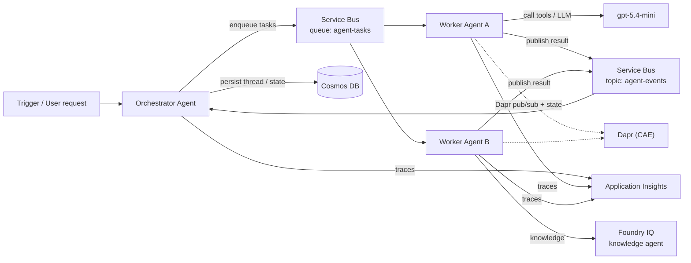

# Orchestration — multi-agent / multi-step workflows

The environment supports self-hosted agents coordinating via **Service Bus** (async messaging),
**Dapr** (pub/sub + state building blocks), and **Cosmos DB** (durable thread/state), with
**Application Insights** tracing across the whole flow.

## Patterns enabled

| Pattern | Backing service |
|---------|-----------------|
| Fan-out / fan-in task distribution | Service Bus queue (`agent-tasks`) |
| Event-driven coordination / choreography | Service Bus topic (`agent-events`) |
| Durable conversation threads & memory | Cosmos DB (`agentstate/threads`) |
| Sidecar pub/sub, state, bindings | Dapr on the Container Apps Environment |
| Reasoning + tool calls | Foundry `gpt-5.4-mini` |
| Grounded knowledge | Foundry IQ knowledge agent over AI Search |
| End-to-end tracing | Application Insights → Log Analytics |

## Self-hosted vs. hosted

Agents run as **self-hosted** containers on Azure Container Apps (not the managed agent
service), giving full control over the runtime, dependencies, and orchestration logic. Images
are pulled from ACR via the shared managed identity (`AcrPull`).
