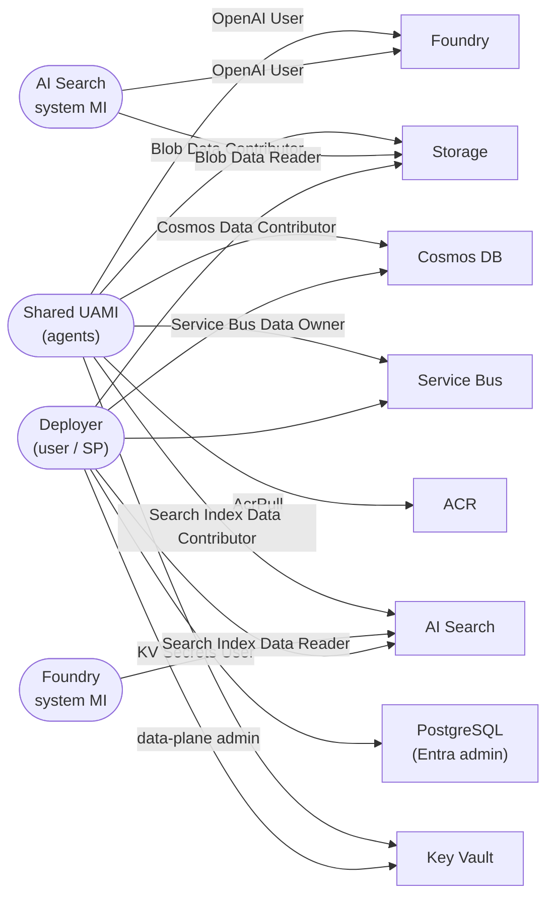

# Identity & RBAC

All service-to-service authentication is **passwordless** via Entra ID. A single shared
**User-Assigned Managed Identity (UAMI)** is used by the agent workloads; AI Search and Foundry
each use their **system-assigned** identities for the RAG pipeline.

## RBAC matrix

| Principal | Role | Scope | Purpose |
|-----------|------|-------|---------|
| Shared UAMI | AcrPull | ACR | Pull agent images |
| Shared UAMI | Key Vault Secrets User | Key Vault | Read secrets |
| Shared UAMI | Storage Blob Data Contributor | Storage | RAG content read/write |
| Shared UAMI | Cognitive Services OpenAI User | Foundry | Call LLM / embeddings |
| Shared UAMI | Search Index Data Contributor | AI Search | Query / write index |
| Shared UAMI | Azure Service Bus Data Owner | Service Bus | Send / receive messages |
| Shared UAMI | Cosmos DB Built-in Data Contributor | Cosmos | Read / write agent state |
| AI Search (system MI) | Cognitive Services OpenAI User | Foundry | Integrated vectorization |
| AI Search (system MI) | Storage Blob Data Reader | Storage | Indexer data source |
| Foundry (system MI) | Search Index Data Reader | AI Search | Agentic retrieval queries |
| Deployer | Key Vault Secrets Officer + data-plane admin | KV, Storage, Search, Cosmos, Service Bus, Postgres | Provisioning + post-provision scripts |

## Notes

- Storage and AI Search have **local/key auth disabled** where supported; access is via Entra RBAC.
- PostgreSQL uses **Entra + password** auth; the deployer is set as an **Entra admin**
  (`entra_admin_principal_type` = `User` for interactive `az login`, `ServicePrincipal` for CI).
- Role assignments are defined inline on AVM modules and in `infra/terraform/rbac.tf`.
