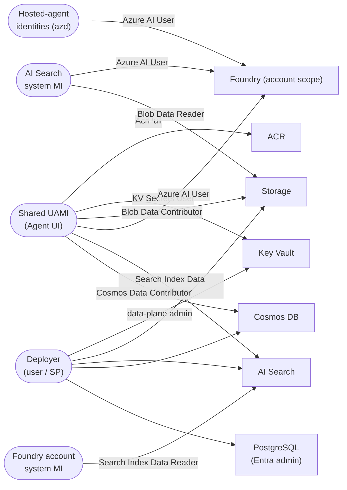

# Identity & RBAC

All service-to-service authentication is **passwordless** via Entra ID. A single shared
**User-Assigned Managed Identity (UAMI)** is used by the Agent UI Container App; AI Search and
the Foundry account each use their **system-assigned** identities for the RAG pipeline; the
**Foundry hosted agents** get **per-agent runtime identities** created by `azd` at deploy time.

## RBAC matrix

| Principal | Role | Scope | Purpose |
|-----------|------|-------|---------|
| Shared UAMI (Agent UI) | AcrPull | ACR | Pull the UI image |
| Shared UAMI (Agent UI) | Key Vault Secrets User | Key Vault | Read secrets |
| Shared UAMI (Agent UI) | Storage Blob Data Contributor | Storage | RAG content read/write |
| Shared UAMI (Agent UI) | **Azure AI User** (`53ca6127-…`) | **Foundry account** | Cognitive Services data plane |
| Shared UAMI (Agent UI) | **Azure AI Developer** (`64702f94-…`) | **Foundry account** | **Invoke** the hosted agents (Responses protocol) |
| Shared UAMI (Agent UI) | Search Index Data Contributor | AI Search | Query / write index |
| Shared UAMI (Agent UI) | Cosmos DB Built-in Data Contributor | Cosmos | Read / write thread state + feedback |
| Hosted-agent identities | Azure AI User | Foundry account | Per-agent runtime auth (model + tools) — assigned by `azd` |
| AI Search (system MI) | Azure AI User (OpenAI User) | Foundry account | Integrated vectorization (embeddings) |
| AI Search (system MI) | Storage Blob Data Reader | Storage | Indexer data source |
| Foundry account (system MI) | Search Index Data Reader | AI Search | Agentic-retrieval queries |
| Foundry project (system MI) | AcrPull | ACR | Pull hosted-agent images (managed out-of-band — see note) |
| Deployer | Key Vault Secrets Officer + data-plane admin | KV, Storage, Search, Cosmos, Postgres | Provisioning + post-provision scripts |

## Why two Foundry roles on the UI identity

Invoking a Foundry **hosted agent** over the Responses protocol triggers an authorization check
for `Microsoft.MachineLearningServices/workspaces/agents/action`. The built-in **Azure AI User**
role (`53ca6127-…`) only grants `Microsoft.CognitiveServices/*` — it has **no**
MachineLearningServices permissions — so on its own it returns **403** on agent invocation. The
UI identity therefore also gets **Azure AI Developer** (`64702f94-…`), which grants
`Microsoft.MachineLearningServices/workspaces/*/action` (including `agents/action`) and is the
least-privilege built-in role that does so. Both roles are referenced by **stable GUID** (not
name) and granted at the **Cognitive Services account** scope (`module.foundry.resource_id`),
since some tenants surface these roles under different display names (e.g. "Foundry User").

## Hosted-agent identities

The three hosted agents (`ggga-planner`, `ggga-researcher`, `ggga-writer`) run on the Foundry
**managed agent service**, not on the Container Apps Environment. Their per-agent runtime
identities are created by `azd` at deploy time, and `azd` auto-assigns each one the **Azure AI
User** role at account scope. Those assignments are therefore **not declared in Terraform**
(the principal IDs only exist after the first `azd deploy`).

## Notes

- The **Foundry project** system-assigned MI also holds **AcrPull** on the registry so the
  platform can pull the hosted-agent images. That assignment already exists in Azure (granted
  out-of-band, assignment GUID `1f697d4d-…`) and is currently **left un-managed** in Terraform —
  the commented-out `foundry_project_acr_pull` block in `rbac.tf` documents the re-import command.
- Storage and AI Search have **local/key auth disabled** where supported; access is via Entra RBAC.
- PostgreSQL uses **Entra + password** auth; the deployer is set as an **Entra admin**
  (`entra_admin_principal_type` = `User` for interactive `az login`, `ServicePrincipal` for CI).
- Cosmos DB data-plane access uses the built-in **Cosmos DB Built-in Data Contributor** SQL role
  (`00000000-0000-0000-0000-000000000002`) for both the UAMI and the deployer.
- Role assignments are defined inline on AVM modules and in `infra/terraform/rbac.tf`.
